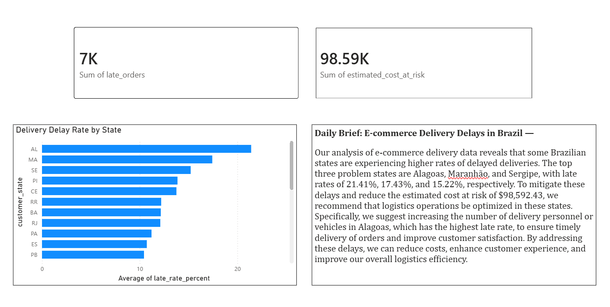

# SwiftTrack — AI-Powered Delivery Performance & Cost Intelligence

Analyzes e-commerce delivery data to identify SLA breach patterns, quantify their 
estimated cost impact, and generate an AI-written daily ops brief — turning raw 
delivery data into a business-ready recommendation.

## Dashboard

## Problem
E-commerce logistics teams often only discover delivery delays after a customer 
complains, and rarely quantify what those delays actually cost the business. 
This project identifies delay hotspots early and estimates their business impact.

## What it does
- Calculated delivery delay (promised vs. actual date) across 96,000+ orders
- Identified delay hotspots by Brazilian state using SQL-style aggregation
- Estimated cost at risk from late deliveries (~$98,500 across 6,534 late orders)
- Integrated the Groq API (LLM) to auto-generate a plain-language daily ops brief
- Built a Power BI dashboard visualizing delay rates, cost impact, and the AI brief

## Dataset
[Olist Brazilian E-Commerce Dataset](https://www.kaggle.com/datasets/olistbr/brazilian-ecommerce) (Kaggle, public)

## Tools
Python (Pandas) · SQL · Power BI · Groq API (Llama 3.3)

## Key finding
Alagoas, Maranhão, and Sergipe had the highest delivery delay rates (21.4%, 17.4%, 
15.2% respectively), with an estimated $98,592 in cost at risk from late deliveries 
across the dataset.
